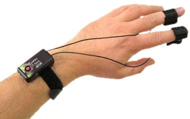

# Studemeter: Emotion and Cognitive Load Detection System

## Introduction

Studemeter aims to revolutionize the educational landscape by 
introducing an innovative system for detecting emotions and cognitive 
load in students. 
We use advanced technologies such as embedded systems, internet of things,
signal processing, and machine learning, 
to provides educators with a comprehensive tool to monitor students' 
emotional states, attention levels, and academic struggles in real-time.

At its core, Studemeter seeks to bridge the gap between educators and students 
by offering insights into students' well-being and learning experiences.
By understanding how students feel, educators can make a supportive 
learning environment.

## Problem Statement
### Challenges Faced by Educators
Educators encounter challenges in understanding students' emotional states and 
cognitive load due to:
- Variability in cognitive load among students makes assessment challenging.
- Limited resources hinder personalized support for students.
- Some educators may overlook the importance of addressing emotional well-being.

### Importance of Addressing These Challenges
Addressing these challenges is crucial for:
- Tailored interventions based on accurate insights lead to improved academic 
  performance and well-being.
- Recognizing and addressing diverse student needs fosters a more inclusive 
  learning environment.
- Integrating these strategies improves student motivation and engagement.

## Literature Review
<!-- - Summary of existing research and literature related to emotion detection and  -->
<!-- cognitive load measurement using GSR sensors -->
<!-- - Insights gained from previous studies and their relevance to the current project -->

## Methodology
<!-- - Overview of the approach used to develop the emotion and cognitive load detection system -->
<!-- - Description of the machine learning model architecture and algorithms employed -->
<!-- - Explanation of the data collection process and sensor integration -->

## Data Collection and Preprocessing
<!-- - Details on the collection of GSR sensor data from student participants -->
<!-- - Preprocessing steps performed to clean and prepare the data for model training -->

## Machine Learning Model Development
<!-- - Description of the machine learning model design and development process -->
<!-- - Explanation of the feature selection and engineering techniques used -->
<!-- - Training methodology and hyperparameter tuning strategies employed -->

## Model Evaluation
<!-- - Evaluation metrics used to assess the performance of the emotion and 
cognitive load detection model -->
<!-- - Results of the model evaluation and analysis of its effectiveness -->

## Discussion
<!-- - Interpretation of the findings from the model evaluation -->
<!-- - Implications of the results for educational practice and student well-being -->
<!-- - Limitations of the study and areas for future research -->

## Conclusion
<!-- - Summary of the key findings and contributions of the project -->
<!-- - Importance of the developed system for enhancing student support and educational outcomes -->

## References
<!-- - List of references cited throughout the documentation -->
<!-- - Academic papers, articles, and other sources used to inform the project -->
