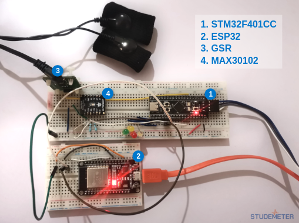
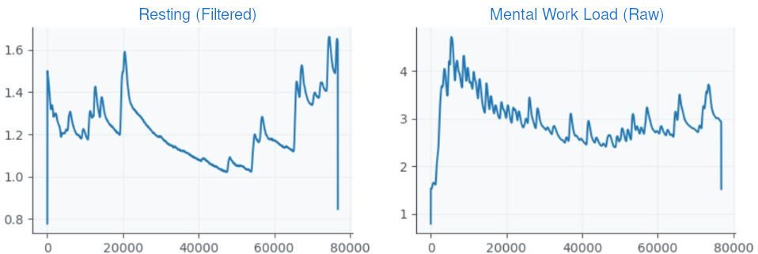
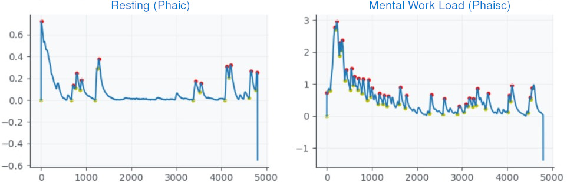
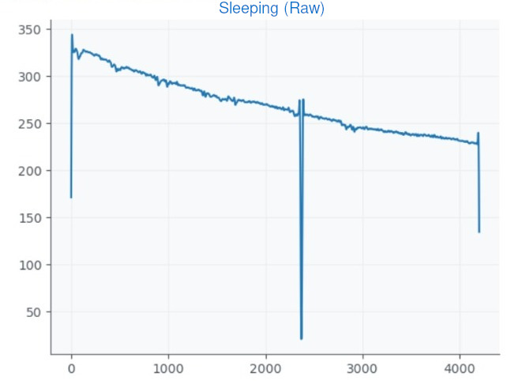

# Studemeter: Emotion and Cognitive Load Detection System

## Introduction

Studemeter aims to revolutionize the educational landscape by 
introducing an innovative system for detecting emotions and cognitive 
load in students. 
We use advanced technologies such as embedded systems, internet of things,
signal processing, and machine learning, 
to provides educators with a comprehensive tool to monitor students' 
emotional states, attention levels, and academic struggles in real-time.

At its core, Studemeter seeks to bridge the gap between educators and students 
by offering insights into students' well-being and learning experiences.
By understanding how students feel, educators can make a supportive 
learning environment.

## Problem Statement
### Challenges Faced by Educators
Educators encounter challenges in understanding students' emotional states and 
cognitive load due to:
- Variability in cognitive load among students makes assessment challenging.
- Limited resources hinder personalized support for students.
- Some educators may overlook the importance of addressing emotional well-being.

### Importance of Addressing These Challenges
Addressing these challenges is crucial for:
- Tailored interventions based on accurate insights lead to improved academic 
  performance and well-being.
- Recognizing and addressing diverse student needs fosters a more inclusive 
  learning environment.
- Integrating these strategies improves student motivation and engagement.

## Literature Review
<!-- - Summary of existing research and literature related to emotion detection and  -->
<!-- cognitive load measurement using GSR sensors -->
<!-- - Insights gained from previous studies and their relevance to the current project -->

## Methodology
<!-- - Overview of the approach used to develop the emotion and cognitive load detection system -->
<!-- - Description of the machine learning model architecture and algorithms employed -->
<!-- - Explanation of the data collection process and sensor integration -->

## Data Collection and Preprocessing
The success of the Studemeter project relies heavily on the accuracy 
and reliability of the data collected and the pre-processing techniques employed. 
This section provides a comprehensive overview of our data collection methodology 
and the preprocessing steps undertaken to ensure the quality of the dataset.

### Data Collection:
1. **Collection of GSR Signal Data:** 
   - Wearable sensor were deployed to collect signal data from team members.
   - Data collection sessions were conducted during various activities.

2. **Integration of Previous Studies Data:**
   - In addition to real-time data collection, we integrated data from previous studies.
   - This provided a broader range of samples for model training and validation.

### Preprocessing Steps:
1. **Initial Data Analysis:** 
   - Upon collection, the raw GSR signal data underwent thorough analysis to identify patterns and anomalies.
   - It became evident that raw data alone did not provide sufficient insights into emotional states and cognitive load.

2. **Low Pass Filtering for Noise Reduction:** 
   - To clean the signal and reduce noise, a low pass filter was applied.
   - The filter was set to a cutoff frequency of around 5 Hz.

3. **Selection of Preprocessing Technique:** 
   - Extensive research and experimentation led us to prioritize the phasic component of the GSR signal for preprocessing.
   - Phasic preprocessing isolates and amplifies the rapid fluctuations in skin conductance.

4. **Visualization of Preprocessed Signal Graphs:**
   - To visualize the effectiveness of our preprocessing technique, graphs of the raw GSR signal data during different activities were captured.
   - These graphs were then processed to highlight the phasic component, resulting in clear representations of emotional arousal levels.

#### Examples of Raw and Preprocessed Data

### Model Approach:
The Studemeter model employs a Support Vector Machine (SVM) algorithm to analyze the 
phasic component of the GSR signal, recognized from previous studies as the most reliable 
indicator of emotional arousal. 
The SVM model is trained on preprocessed GSR data to accurately 
classify students' emotional states and cognitive load levels in real-time.

1. **Feature Extraction:** 
   - Prior to model training, relevant features are extracted from the preprocessed GSR data. 
   - These features capture key characteristics of the phasic component, such as amplitude and frequency of skin conductance responses.

2. **Training and Validation:** 
   - The SVM model is trained on a labeled dataset, where each sample is associated with a specific emotional state or cognitive load level.
   - Cross-validation techniques are employed to ensure the robustness and generalization ability of the model across different datasets.

3. **Real-time Classification:** 
   - Once trained, the model was capable of classifying new GSR data samples.
   - Real-time classification enables educators to promptly identify students in need of support and intervention.

## Machine Learning Model Development
<!-- - Description of the machine learning model design and development process -->
<!-- - Explanation of the feature selection and engineering techniques used -->
<!-- - Training methodology and hyperparameter tuning strategies employed -->

## Model Evaluation
<!-- - Evaluation metrics used to assess the performance of the emotion and 
cognitive load detection model -->
<!-- - Results of the model evaluation and analysis of its effectiveness -->

## Discussion
<!-- - Interpretation of the findings from the model evaluation -->
<!-- - Implications of the results for educational practice and student well-being -->
<!-- - Limitations of the study and areas for future research -->

## Conclusion
<!-- - Summary of the key findings and contributions of the project -->
<!-- - Importance of the developed system for enhancing student support and educational outcomes -->

## References
<!-- - List of references cited throughout the documentation -->
<!-- - Academic papers, articles, and other sources used to inform the project -->
- Analysis of EDA data using Ledalab
- GALVANIC SKIN RESPONSE MEASUREMENT DATA PROCESSING FOR USER-RELATED INFORMATION EXTRACTION
- Cognitive Load Monitoring With Wearables—Lessons Learned From a Machine Learning Challenge
- Cognitive Load Measurement Using Arithmetic and Graphical Tasks and Galvanic Skin Response
- Realtime Determination of Mood in Classroom Environment
