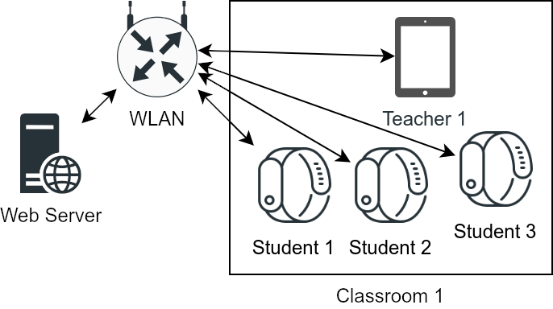
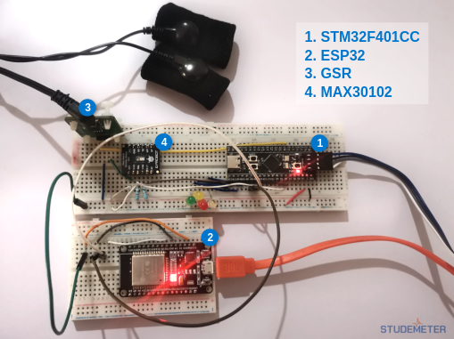
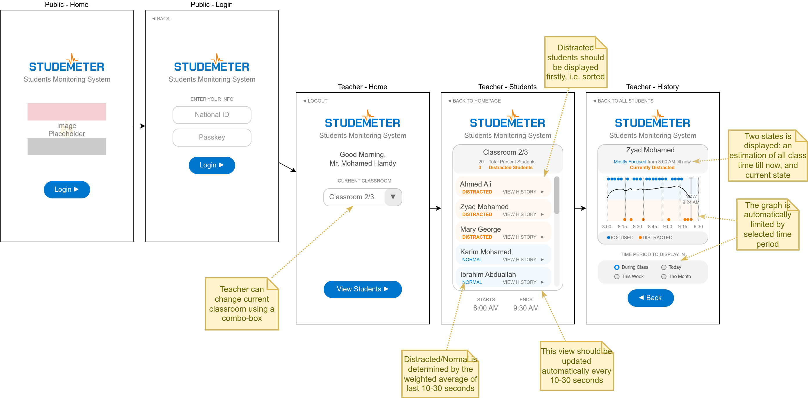
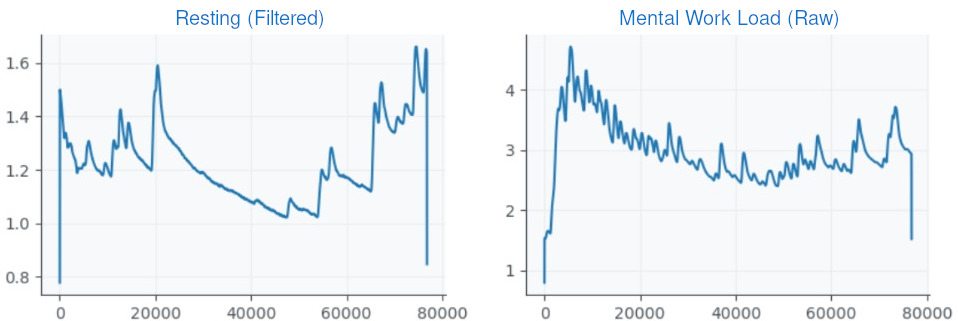
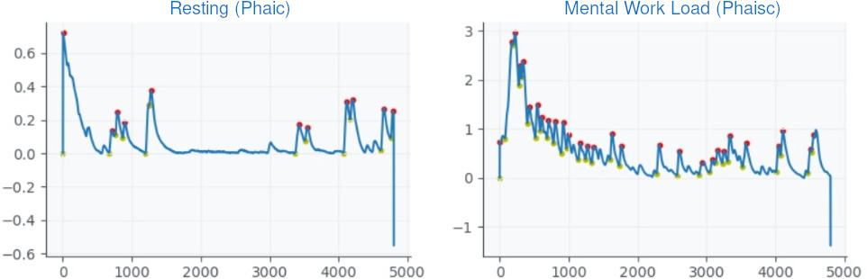

# 🎓 Studemeter: Emotion & Cognitive Load Detection  

## 🚀 Introduction  

Studemeter leverages **IoT, machine learning, and signal processing** to detect students' **emotions and cognitive load** in real time, helping educators enhance learning experiences.  

## 🔥 Why Studemeter?  

### **Challenges**  
❌ Hard to assess cognitive load & emotions  
❌ Limited personalized student support  
❌ No real-time engagement tracking  

### **Solutions**  
✅ **Live emotion & cognitive insights**  
✅ **GSR sensors + ML for accuracy**  
✅ **Personalized learning recommendations**  

---

## 🛠️ Tech Stack  

- **Frontend:** Next.js (React, TypeScript, SCSS)  
- **ML Model:** Support Vector Machine (SVM)  
- **IoT Sensors:** Galvanic Skin Response (GSR)  
- **Data Processing:** Low-pass filtering, phasic signal isolation  

---

## 🖥️ UI/UX Preview  

  

### **Features**  
✅ **Live Dashboard** - Real-time cognitive & emotion tracking  
✅ **Student History** - Past engagement trends  
✅ **Alerts** - Detect students needing support  

---

## 📡 Data Collection & Processing  

### **1️⃣ GSR Data Collection**  
- Wearable sensors track **skin conductance**.  
- Collected during **various learning activities**.  
- Uses **external datasets** for model improvement.  

### **2️⃣ Preprocessing & Feature Engineering**  
- **Noise Reduction:** 5Hz low-pass filter  
- **Phasic Signal Extraction:** Rapid fluctuation detection  
- **Feature Engineering:** Amplitude, frequency, variation analysis  

### **📊 Data Visualization**  
  

---

## 🤖 Machine Learning  

**Model:** Support Vector Machine (SVM)  
- **Training:** Labeled student emotion & cognitive load data  
- **Validation:** Cross-validation for generalization  
- **Real-time Prediction:** Instant emotion detection  

📌 **Example:**  
  

---

## 📚 References  

1. **EDA Analysis** using Ledalab  
2. **Cognitive Load Monitoring** via Wearables  
3. **GSR Data Processing** Research  

## 💡 Future Enhancements  

- 🚀 **Deep Learning** for improved emotion detection  
- 📊 **Mobile App** for real-time tracking  
- 🔬 **Expanded Sensors** (Heart Rate, EEG)  

## 🏆 Contributors  

- 👤 **Mohamed Hamdy** - IoT & Embedded Systems [GitHub](https://github.com/mohammedhamdy32)  
- 👤 **Mazen Hany** - ML, Data Processing  
- 👤 **Ziad Mahmoud** - Backend Development [GitHub](https://github.com/ziad-mahmoud22)  
- 👤 **Karim Muhammad** - UI/UX, Frontend Development [GitHub](https://github.com/karim-m-ali)  

⭐ **Like the project? Give it a star!** ⭐  
